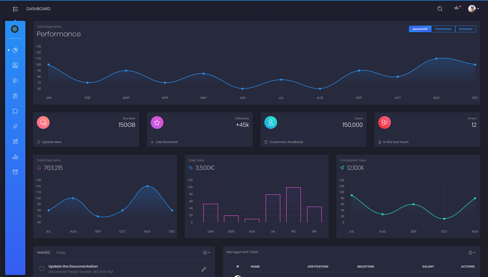
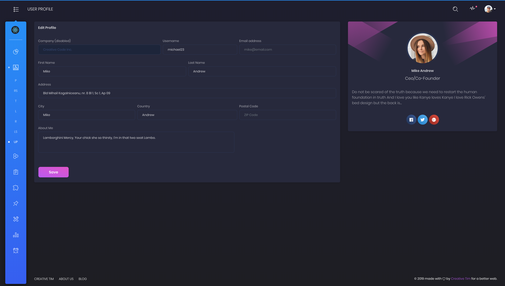
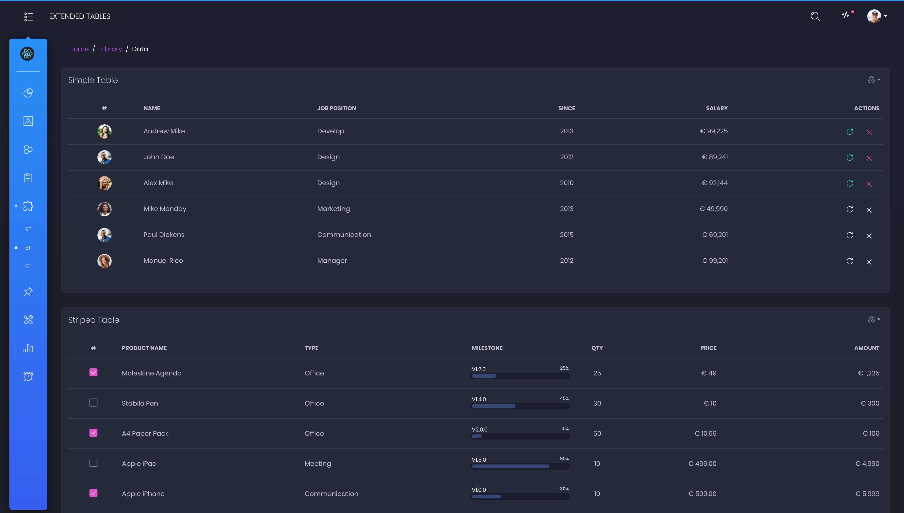
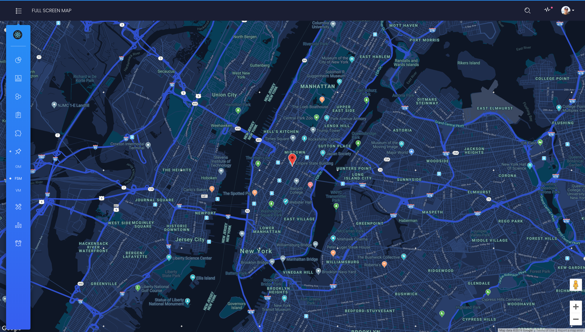
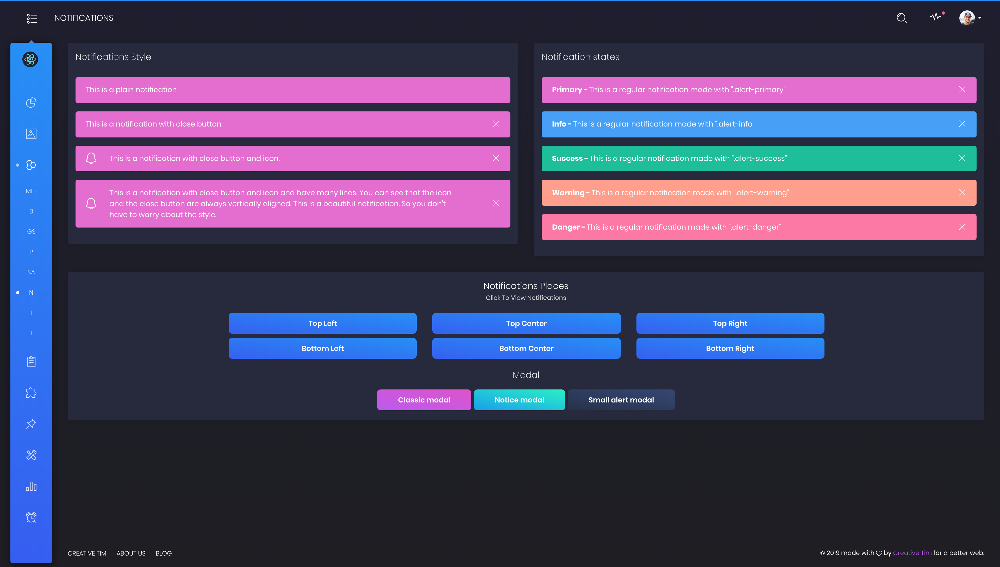

# [Black Dashboard PRO React](https://demos.creative-tim.com/black-dashboard-pro-react/#/admin/dashboard) [](https://twitter.com/intent/tweet?url=https%3A%2F%2Fdemos.creative-tim.com%2Fblack-dashboard-pro-react%2F%23%2Fadmin%2Fdashboard&text=Black%20Dashboard%20PRO%20React%20-%20Premium%20Bootstrap%20Admin%20Template&original_referer=https%3A%2F%2Fdemos.creative-tim.com%2Fblack-dashboard-pro-react%2F&via=creativetim&hashtags=react%2Cbootstrap%2Creactstrap%2Ccreativetim%2Ccreativetimofficial)


 []() []()  [](https://discord.gg/E4aHAQy)


Black Dashboard PRO React is a beautiful [Bootstrap 4](http://getbootstrap.com/), [Reacstrap](https://reactstrap.github.io/) and [React](https://reactjs.org/) ([create-react-app](https://github.com/facebook/create-react-app)) Admin Dashboard with a huge number of components built to fit together and look amazing. If you are looking for a tool to manage and visualize data about your business, this dashboard is the thing for you. It combines colors that are easy on the eye, spacious cards, beautiful typography, and graphics.
Black Dashboard PRO React comes packed with all plugins that you might need inside a project and documentation on how to get started. It is light and easy to use, and also very powerful.

Black Dashboard PRO React features over 160 individual components, giving you the freedom of choosing and combining. This means that there are thousands of possible combinations. All components can take variations in color, that you can easily modify using SASS files. You will save a lot of time going from prototyping to full-functional code because all elements are implemented.
We thought about everything, so this dashboard comes with 2 versions, Dark Mode and Light Mode.

Special thanks go for the owners of these plugins:
- [chartjs](https://www.chartjs.org/)
- [jvectormap](http://jvectormap.com/)
- [nouislider](https://refreshless.com/nouislider/)
- [nucleoapp](https://nucleoapp.com/?ref=1712)
- [perfect-scrollbar](https://www.npmjs.com/package/perfect-scrollbar)
- [react-big-calendar](https://github.com/intljusticemission/react-big-calendar)
- [react-bootstrap-sweetalert](https://github.com/djorg83/react-bootstrap-sweetalert)
- [react-bootstrap-switch](https://github.com/Julusian/react-bootstrap-switch)
- [react-chartjs-2](https://github.com/jerairrest/react-chartjs-2)
- [react-datetime](https://github.com/YouCanBookMe/react-datetime)
- [react-google-maps](https://github.com/tomchentw/react-google-maps)
- [react-jvectormap](https://www.npmjs.com/package/react-jvectormap)
- [react-select](https://github.com/JedWatson/react-select)
- [react-table](https://react-table.js.org/#/story/readme)
- [react-tagsinput](https://github.com/olahol/react-tagsinput)

We are very excited to share this dashboard with you and we look forward to hearing your feedback!

**Example Pages** We wanted to fully display the power of this dashboard, so the kit comes packed with examples showing you how to use the components.

## Table of Contents

* [Versions](#versions)
* [Demo](#demo)
* [Quick Start](#quick-start)
* [Documentation](#documentation)
* [File Structure](#file-structure)
* [Browser Support](#browser-support)
* [Resources](#resources)
* [Reporting Issues](#reporting-issues)
* [Technical Support or Questions](#technical-support-or-questions)
* [Licensing](#licensing)
* [Useful Links](#useful-links)


## Versions

[](https://themes.getbootstrap.com/product/black-dashboard-pro-premium-bootstrap-4-admin/)
[](https://www.creative-tim.com/product/black-dashboard-pro-react)[](https://www.creative-tim.com/product/vue-black-dashboard-pro)


| HTML | React | Vue |
| --- | --- | --- |
| [](https://themes.getbootstrap.com/product/black-dashboard-pro-premium-bootstrap-4-admin/) | [](https://www.creative-tim.com/product/black-dashboard-pro-react) | [](https://www.creative-tim.com/product/vue-black-dashboard) |

## Demo

| Dashboard | User Profile | Tables | Maps | Notification |
| --- | --- | --- | --- | --- |
| [](https://demos.creative-tim.com/black-dashboard-pro-react/#/admin/dashboard) | [](https://demos.creative-tim.com/black-dashboard-pro-react/#/admin/user-profile) | [](https://demos.creative-tim.com/black-dashboard-pro-react/#/admin/extended-tables) | [](https://demos.creative-tim.com/black-dashboard-pro-react/#/admin/full-screen-map) | [](https://demos.creative-tim.com/black-dashboard-pro-react/#/admin/notifications)

[View More](https://demos.creative-tim.com/black-dashboard-pro-react/#/admin/dashboard).


## Quick start

Quick start options:

- [Buy from Creative Tim](https://www.creative-tim.com/product/black-dashboard-pro-react).


## Documentation
The documentation for the Black Dashboard PRO React is hosted at our [website](https://demos.creative-tim.com/black-dashboard-pro-react/#/documentation/tutorial).


## File Structure

Within the download you'll find the following directories and files:

```
black-dashboad-pro-react
.
│
├── CHANGELOG.md
├── README.md
├── package.json
├── Documentation
│   └── documentation.html
├── public
│   └── index.html
└── src
    ├── index.js
    ├── routes.js
    ├── logo.svg
    ├── assets
    │   ├── css
    │   ├── demo
    │   ├── fonts
    │   ├── img
    │   └── scss
    │       ├── black-dashboard-pro-react
    │       │   ├── bootstrap
    │       │   │   ├── mixins
    │       │   │   └── utilities
    │       │   ├── custom
    │       │   │   ├── cards
    │       │   │   ├── mixins
    │       │   │   ├── utilities
    │       │   │   └── vendor
    │       │   └── react
    │       │       └── plugins
    │       └── black-dashboard-pro-react.scss
    ├── components
    │   ├── CustomUpload
    │   │   └── ImageUpload.jsx
    │   ├── FixedPlugin
    │   │   └── FixedPlugin.jsx
    │   ├── Footer
    │   │   └── Footer.jsx
    │   ├── Navbars
    │   │   ├── AdminNavbar.jsx
    │   │   ├── AuthNavbar.jsx
    │   │   └── RTLNavbar.jsx
    │   ├── Sidebar
    │   │   └── Sidebar.jsx
    │   └── SortingTable
    │       └── SortingTable.jsx
    ├── layouts
    │   ├── Admin
    │   │   └── Admin.jsx
    │   ├── Auth
    │   │   └── Auth.jsx
    │   └── RTL
    │       └── RTL.jsx
    ├── variables
    │   ├── charts.jsx
    │   ├── general.jsx
    │   └── icons.jsx
    └── views
        ├── Calendar.jsx
        ├── Charts.jsx
        ├── Dashboard.jsx
        ├── Widgets.jsx
        ├── components
        │   ├── Buttons.jsx
        │   ├── Grid.jsx
        │   ├── Icons.jsx
        │   ├── Notifications.jsx
        │   ├── Panels.jsx
        │   ├── SweetAlert.jsx
        │   └── Typography.jsx
        ├── forms
        │   ├── ExtendedForms.jsx
        │   ├── RegularForms.jsx
        │   ├── ValidationForms.jsx
        │   ├── Wizard.jsx
        │   └── WizardSteps
        │       ├── Step1.jsx
        │       ├── Step2.jsx
        │       └── Step3.jsx
        ├── maps
        │   ├── FullScreenMap.jsx
        │   ├── GoogleMaps.jsx
        │   └── VectorMap.jsx
        ├── pages
        │   ├── Lock.jsx
        │   ├── Login.jsx
        │   ├── Pricing.jsx
        │   ├── Register.jsx
        │   ├── Rtl.jsx
        │   ├── Timeline.jsx
        │   └── User.jsx
        └── tables
            ├── ExtendedTables.jsx
            ├── ReactTables.jsx
            └── RegularTables.jsx
```

## Browser Support

At present, we officially aim to support the last two versions of the following browsers:

    


## Resources
- Demo: https://demos.creative-tim.com/black-dashboard-pro-react/#/admin/dashboard
- Download Page: https://www.creative-tim.com/product/black-dashboard-pro-react
- Documentation: https://demos.creative-tim.com/black-dashboard-pro-react/#/documentation/tutorial
- License Agreement: https://www.creative-tim.com/license
- Support: https://www.creative-tim.com/contact-us
- Issues: [Github Issues Page](https://github.com/creativetimofficial/ct-black-dashboard-pro-react/issues)

## Reporting Issues
We use GitHub Issues as the official bug tracker for the Black Dashboard PRO React. Here are some advices for our users that want to report an issue:

1. Make sure that you are using the latest version of the Black Dashboard PRO React. Check the CHANGELOG from your dashboard on our [website](https://www.creative-tim.com/).
2. Providing us reproducible steps for the issue will shorten the time it takes for it to be fixed.
3. Some issues may be browser specific, so specifying in what browser you encountered the issue might help.

## Technical Support or Questions

If you have questions or need help integrating the product please [contact us](https://www.creative-tim.com/contact-us) instead of opening an issue.

## Licensing

- Copyright 2020 Creative Tim (https://www.creative-tim.com)
- Creative Tim [License](https://www.creative-tim.com/license)

## Useful Links

More products from Creative Tim: <https://www.creative-tim.com/products>

Tutorials: <https://www.youtube.com/channel/UCVyTG4sCw-rOvB9oHkzZD1w>

Freebies: <https://www.creative-tim.com/products>

Affiliate Program (earn money): <https://www.creative-tim.com/affiliates/new>

Social Media:

Twitter: <https://twitter.com/CreativeTim>

Facebook: <https://www.facebook.com/CreativeTim>

Dribbble: <https://dribbble.com/creativetim>

Google+: <https://plus.google.com/+CreativetimPage>

Instagram: <https://instagram.com/creativetimofficial>
